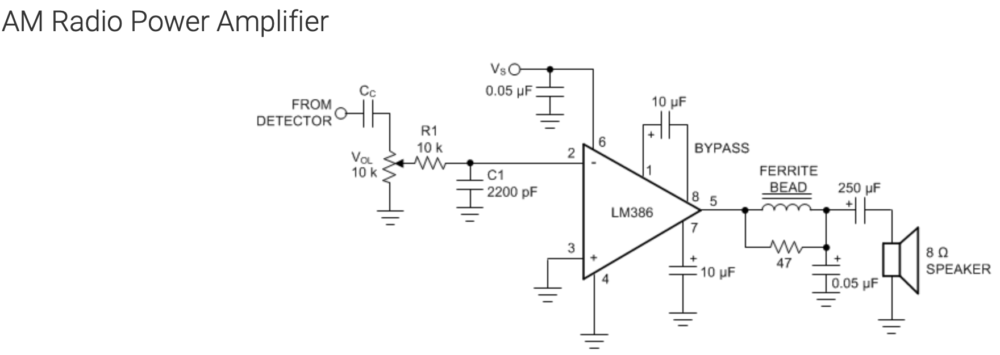

# AM Radio Project

This is my custom-built AM radio circuit, designed to pick up local stations. It uses:

- A germanium diode for signal detection.
- A custom LC circuit for tuning.
- An LM386 amplifier for audio output.
- A 9V battery for powering the audio amplifier.

The result is only about 2 stations, with 860 kHz coming in clearest.

### Circuit Diagrams

This project came from Chapter 1 of *The Art of Electronics* by Horowitz and Hill. On page 56, they introduced the circuit diagram that explains the LC circuit.

In searching for an appropriate audio amplifier, I found the [LM386 Low Voltage Audio Amplifier](https://www.ti.com/document-viewer/LM386/datasheet#GUID-0D386304-A963-47B1-A99A-4320CD1E1874/TITLE-SNAS545X1693) and its recommended circuit diagram for an AM radio.

Lastly, I did not have a capacitor small enough to substitute for C1 or the ferrite bead in parallel with the RC circuit, so I skipped both of those parts in this circuit.

### Calculating the Inductor

From section 1.7.14 on **Resonant Circuits** in *The Art of Electronics*, I learned the formula for the resonant frequency:

f₀ = 1 / (2π√(LC))

Given that my variable capacitor is approximately **365 pF** ([spec sheet](https://www.tubesandmore.com/products/capacitor-365pf-variable-single-section)), I calculated that my inductor needed to be about **150 µH** to access frequencies along the AM radio spectrum.

To simplify the process of designing the inductor, I used an [online calculator](http://www.circuits.dk/calculator_single_layer_aircore.htm) to determine the number of turns needed. Using a **3-inch empty plastic bottle** as the core and **18 AWG enamel copper wire**, the result was approximately **46-47 turns** to generate 150 µH of inductance.

Here's a closer look at my coil:

### Connecting the Antenna

I strung up my antenna and connected it to my breadboard. Here's how it looks:

  
  

### Completing the Circuit

To complete the AM radio circuit, I followed these steps:

1. **Connecting the LC Circuit:**
   - As per the circuit diagram in *The Art of Electronics*, I connected the LC circuit to ground and in parallel with the rest of the circuit (before the germanium diode).

   

2. **Adding the Germanium Diode:**
   - I added the germanium diode in series with the resistors leading to pin 2 of the LM386. The variable resistor shown is a 10K-ohm resistor which helps control the volume. 
   
   

3. **Adding Remaining Parts:**
   - I added the remaining components to the breadboard, including capacitors in parallel to achieve ~250 µF. All of this connects to the 8-ohm speaker.
   
   

4. **Adding 8 ohm Speaker and Battery Connection:**
   - The battery is not yet connected, but the battery connector is prepared to receive a 9V battery.
   
   

5. **Establishing Grounding:**
   - Without a grounding rod, I ran a wire to an outdoor copper water pipe to serve as the ground connection.
   
   

### Testing the Circuit

Once everything was connected, I turned on the circuit and tuned into the Bay Area's **860 kHz AM radio station**. Et voilà! I could listen to an interview with Liz Truss, former British PM, with quite a bit of background noise but still pretty cool.

<video src='https://youtube.com/shorts/wH2nYk54Lk0?feature=share' width=180/>

